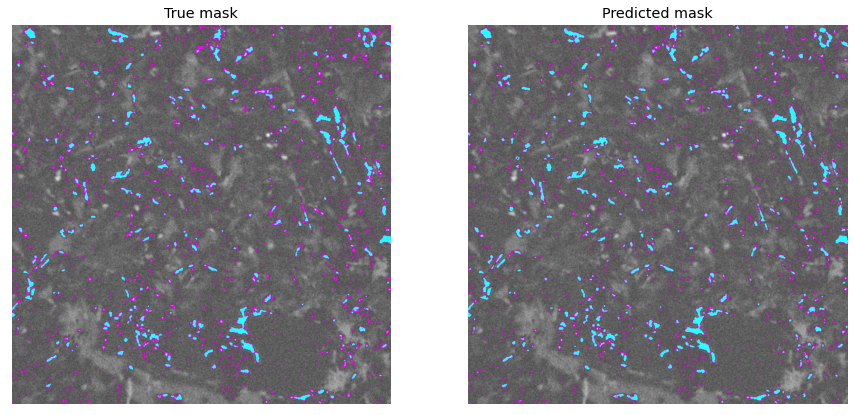

# Rocks-Unet
Segmentation of micro and macro structures

This repository contains those codes for performing image segmentation of Micro and Macro structures in CT Geo-rocks.

1. Open [Unet_main](Unet_main.py) and modify paths:

    * Path_images
    * Path_mask_1
    * Path_mask_2

2. Files saved after Running:

    * Database_sorted.csv
    * model-Unet_multiclass_1.json
    * model-Unet_multiclass_1.h5
    * Results_history.csv
    * Results_metrics.csv

    
